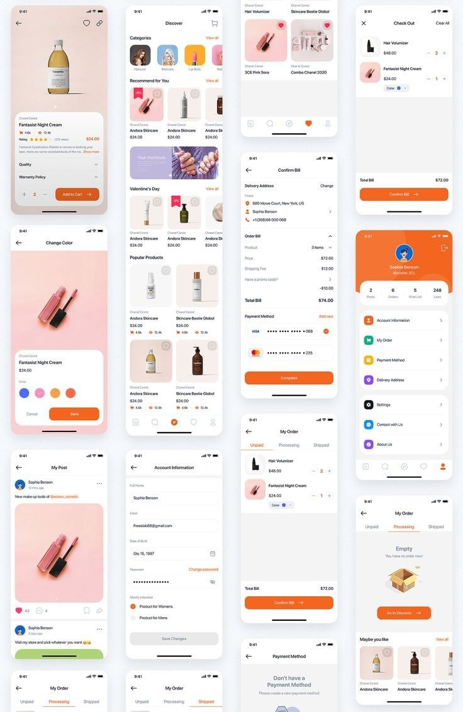

# 1er Parcial (Fundamentos de UI, rutas y estado)
Navegación con Expo Router (basado en React Navigation)
Tabs: Inicio, Mercado, Publicar (placeholder), Perfil (placeholder).
Stack en Mercado: MercadoList → ItemDetail.
## Listado principal (FlatList) de items de intercambio/venta(mín. 20 ítems):

## Detalle de Item:
 imagen/cover, título, categoría, tipo, estado, carrera, precio, descripción completa, alias del publicador y acciones:
## zustand 
store ui
store market 
store user 

